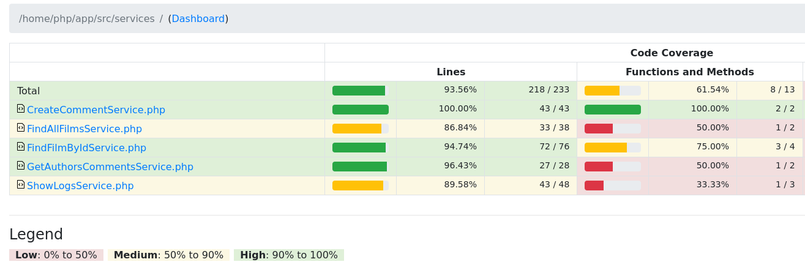

# Documentação

## Sumário

- [Melhorias realizadas](#melhorias-realizadas)
- [Melhorias futuras](#melhorias-futuras)
- [Arquitetura MVC](#arquitetura-mvc)
- [Banco de dados](#banco-de-dados)
- [Como executar](#como-executar)
    - [Docker](#docker)
    - [Sem o Docker](#sem-o-docker)
- [Rotas](#rotas)
- [Acessando o PhpMyAdmin](#acessando-o-phpmyadmin)
- [Executando CI/CD localmente](#executando-cicd-localmente)
- [Executando testes e vendo a cobertura](#executando-testes-e-vendo-a-cobertura)
- [Como limpar o cache?](#como-limpar-o-cache)
- [Sistema sendo usado (YouTube)](#sistema-sendo-usado-youtube)
- [Sistema sendo usado (Screenshots)](#sistema-sendo-usado-screenshots)
- [Backlog](#backlog)

## Melhorias realizadas

- Página para visualização dos logs.
- Página dos detalhes do filme lista os comentários e pode criar comentário.
- Página que lista os autores dos comentários e os filmes que cada um comentou.
- Testes automatizados.
- Pipeline CI/CD no GitHub para verificar se o código está funcionando.
- Cache (em disco) em cada requisição para aumentar a performance e não atingir o máximo de requests da API do Star Wars usada.

## Melhorias futuras

- Melhorar o código:
    - Usar mais a camada model;
    - Fazer logs no GetAuthorsCommets e CreateComment;
    - Organizar o Index;
    - Tratar erro 500;
    - Melhorar o response dos controllers e retornar status code melhor.
- Testes com Cypress para garantir que o frontend e backend estão funcionando corretamente.
- Tempo de expiração no cache.
- Usar lib de análise estática de código (Psalm ou PHPStan) para ter mais qualidade no código.
- Deixar mais dinâmico as rotas, a query string, o path parameter.
- Organizar o a lógica que irá chamar o controller baseado na rota.
- Fazer mais testes unitários para a lógica do service e de outras camadas.

## Arquitetura MVC

MVC e foi adicionada mais camadas para tornar os testes de integração mais fáceis.

- `Index`: camada que inicia a aplicação, faz tratamento das rotas, monta as dependencias do controller e envia para o controller que é responsável pela rota.
- `Controller`: camada que recebe a requisição e envia para o service ou finaliza a requisição com algum status code.
- `View`: onde estão as páginas e css.
- `Service`: camada que osquestra as chamadas, executa também a lógica geral.
- `Model`: onde contém as entidades usadas e que contém a lógica.
- `Repository`: camada que faz comunicação externa, seja ao banco de dados, api externa (HTTP Client), disco (Cache), memória e etc.
- `Database`: MySQL, onde armazena os dados.

## Banco de dados

## Como executar

### Docker

- Suba o docker compose que será configurado tudo de forma automática: `docker compose up -d --build`.
- A url é usada é `http://localhost:3000/`.

### Sem o Docker

- Instale as dependencias caso deseja executar os testes: `composer install`.
- Crie o banco de dados usando o arquivo `./database.sql`.
- Configure o `DB_HOST`, `DB_PORT`, `DB_DATABASE`, `DB_USER`, `DB_PASSWORD` do banco de dados no arquivo `./env.json` que será usado na aplicação.
- Execute a aplicação: `php -S 0.0.0.0:3000 ./src/index.php` ou `php -S localhost:3000 ./src/index.php`.
- Acesse a aplicação pela url que foi configurada.

## Rotas

No arquivo ./backend.http, possui todas as rotas.

## Acessando o PhpMyAdmin

A url é usada: `http://localhost:8081/`.

## Executando CI/CD localmente

> Precisa instalar o act, pode ser visto [aqui](https://nektosact.com/installation/index.html).

- Execução do CI/CD: `make ci-cd`.

## Executando testes e vendo a cobertura

- Executar os testes e cobertura de código: `make docker-test-cov`.
- O arquivo html criado para visualizar a cobertura de código está em `./cover/index.html`.

## Como limpar o cache?

No diretório `cache/` pode ser removido todos os arquivos que termina com `.json`.

## Sistema sendo usado (YouTube)

## Sistema sendo usado (Screenshots)

## Backlog

- Requisitos obrigatórios:
    - PHP 7.4, PHP com POO, MySQL, código 100% desenvolvido
    - HTML, CSS, Javascript, JQuery e Bootstrap
    - Código deverá ser encaminhado
    - Dump do banco de dados
    - Lista de melhorias
    - Os dados dos filmes deverão ser buscados pela API `https://swapi.py4e.com/`
    - Usuário pode lista os filmes do Star Wars
        - Ordenado por: data de lançamento.
        - Exibir: nome e data de lançamento.
    - Usuário pode selecionar um filme e ver seus detalhes
        - Nome;
        - Nº episódio;
        - Sinopse;
        - Data de lançamento;
        - Diretor(a);
        - Produtor(es);
        - Nome dos personagens;
        - A idade dos filmes em anos, meses e dias. Calculo deve ser feito no backend.
    - A exibição das telas devem ser em páginas e endpoints diferentes.
    - Sempre que houver requisição a API local, deve ser registrado um log com informações de data/hora e a solicitação.
    - Organização em MVC.
    - O usuário poderá ver os logs, datetime, evento, level, path, status code
        - Pode filtrar por level, datetime e status code
- Requisitos não obrigatórios:
    - Usuário pode se cadastrar
    - Somente usuário cadastrado pode fazer um ranking de filmes e ver rankings de outras pessoas
    - Usuário pode listar os filmes mais amados
    - Validações nos dados de entrada e no banco de dados
    - Usar APM para monitorar a performance
    - GitHub Actions CI: Rodar testes automatizados e permitir o merge só quando tudo funcionou
    - Testar o frontend e backend com o cypress
    - Usar API versioning
    - Ferramentas de qualidade de código (PHP CS Fixer, PHP Stan)
- Documentação:
    - Desenho da arquitetura
    - Desenho e explicação da organização das pastas
    - Commits organizados e pequenos
    - Fazer vídeo usando e instalando o projeto
    - Screenshots do projeto
    - Como instalar, executar, executar os testes, usar o docker, usar o cypress
    - Modelagem de dados, DER
    - Quanto de recurso o sistema consome em quais cargas (K6 e APM)
- Explicações (explicar melhorias também)
    - CI/CD e Code Owners
    - Cache na API do Star Wars
    - K6 e APM
    - Cypress
    - Docker

