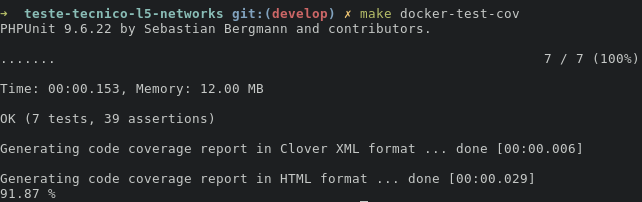

# Documentação

Deve ser feita uma integração com a API do Star Wars em PHP 7.4 sem frameworks e libs, POO, Bootstrap, MySQL, JQuery e arquitetura em MVC.

**Funcionalidades feitas:**

- Página de listagem de filmes;
- Página de detalhes do filme com listagem de comentários e formulário;
- Página de listagem de logs;
- Página de listagem dos autores dos comentários.

**O que foi usado no código a mais:**

- Testes automatizados para mater a qualidade;
- Uso do Docker;
- Cache em disco nos dados retornados da API externa;
    - Motivo: aumentar a performance e não atingir o máximo de requests da API do Star Wars usada.
- CI/CD que roda os testes e verifica se a cobertura é de 80%;
    - Motivo: manter a qualidade em cada PR.
- PHP CS Fixer para forçar o padrão de estilo de código;
- Arquitetura em MVC e uso de outras camadas para organizar o código.

> A organização das tarefas, o backlog está no GitHub Projects: [https://github.com/users/deirofelippe/projects/2](https://github.com/users/deirofelippe/projects/2)

## Vídeo da aplicação sendo usada

## Sumário

- [Arquitetura MVC](#arquitetura-mvc)
- [Banco de dados](#banco-de-dados)
- [Como executar](#como-executar)
    - [Docker](#docker)
    - [Sem o Docker](#sem-o-docker)
- [Melhorias futuras](#melhorias-futuras)
- [Rotas](#rotas)
- [Acessando o PhpMyAdmin](#acessando-o-phpmyadmin)
- [Executando CI/CD localmente](#executando-cicd-localmente)
- [Executando testes e vendo a cobertura](#executando-testes-e-vendo-a-cobertura)
- [Como limpar o cache?](#como-limpar-o-cache)
- [Sistema sendo usado (Screenshots)](#sistema-sendo-usado-screenshots)

## Arquitetura MVC

MVC e foi adicionada mais camadas para tornar os testes de integração mais fáceis.

- `Index`: camada que inicia a aplicação, faz tratamento das rotas, monta as dependências do controller e envia para o controller que é responsável pela rota.
- `Controller`: camada que recebe a requisição e envia para o service ou finaliza a requisição com algum status code.
- `View`: onde estão as páginas e css.
- `Service`: camada que orquestra as chamadas e executa a lógica geral.
- `Model`: onde contém as entidades usadas e que contém a lógica relacionada a entidade.
- `Repository`: camada que faz comunicação externa, seja ao banco de dados, api externa (HTTP Client), disco (Cache), memória e etc.
- `Database`: MySQL, onde armazena os dados.

## Banco de dados

## Como executar

### Docker

- Suba o docker compose que será configurado tudo de forma automática: `docker compose up -d --build`.
- A url é usada é `http://localhost:3000/`.

### Sem o Docker

- Instale as dependências caso deseja executar os testes: `composer install`.
- Crie o banco de dados usando o arquivo `./database.sql`.
- Configure o `DB_HOST`, `DB_PORT`, `DB_DATABASE`, `DB_USER`, `DB_PASSWORD` do banco de dados no arquivo `./env.json` que será usado na aplicação.
- Execute a aplicação: `php -S 0.0.0.0:3000 ./src/index.php` ou `php -S localhost:3000 ./src/index.php`.
- Acesse a aplicação pela url que foi configurada.

## Melhorias futuras

- Melhorar o código:
    - Usar mais a camada model;
    - Fazer logs no GetAuthorsCommets e CreateComment;
    - Organizar o Index;
    - Tratar erro 500;
    - Melhorar o response dos controllers e retornar status code melhor.
- Testes com Cypress para garantir que o frontend e backend estão funcionando corretamente.
- Tempo de expiração no cache.
- Usar lib de análise estática de código (Psalm ou PHPStan) para ter mais qualidade no código.
- Deixar mais dinâmico as rotas, a query string, o path parameter.
- Organizar o a lógica que irá chamar o controller baseado na rota.
- Fazer mais testes unitários para a lógica do service e de outras camadas.

## Rotas

No arquivo ./backend.http, possui todas as rotas.

## Acessando o PhpMyAdmin

A url é usada: `http://localhost:8081/`.

## Executando CI/CD localmente

> Precisa instalar o act, pode ser visto [aqui](https://nektosact.com/installation/index.html).

- Execução do CI/CD: `make ci-cd`.

## Executando testes e vendo a cobertura

- Executar os testes e cobertura de código: `make docker-test-cov`.
- O arquivo html criado para visualizar a cobertura de código está em `./cover/index.html`.

## Como limpar o cache?

No diretório `cache/` pode ser removido todos os arquivos que termina com `.json`.

## Sistema sendo usado (Screenshots)

